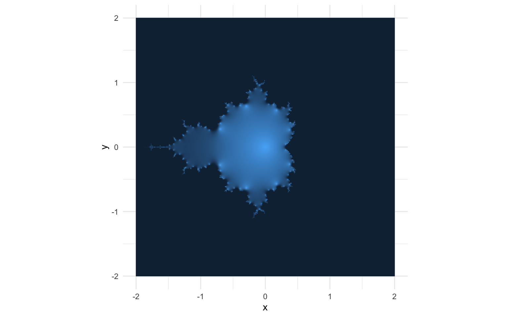

# Intro: Iteration and Recursion

One fun lessons in the [Structure and Interpretation of Computer Programs](https://mitp-content-server.mit.edu/books/content/sectbyfn/books_pres_0/6515/sicp.zip/index.html)[^1] is the translation of functions between *iterative* and *recursive* approaches.

To show the difference between iterative and recursive procedures, let's make a quick example where we raise a number to some (positive integer) power.
We could implement an iterative approach in R using a for loop.
We call this iterative because each pass through the loop is an "iteration".

``` r
# power must be an integer >= 0
pow_iter = function(x, power) { 
    if (power == 0) { return(1) }
    if (power == 1) { return(x) }
    # the iterative part:
    result = x
    for (i in 2:power) {
       result = result * x 
    } 
    return(result)
}
```

Or we could do this with a recursive function.
We call this function "recursive" because the function calls itself in its own implementation.

``` r
pow_rec = function(x, power) {
    if (power == 0) { return(1) }
    if (power == 1) { return(x) }
    # here be recursion
    x * pow_rec(x, power - 1)
}
```

The recursive approach uses the fact that $x^n = x \times x^{n - 1}$ to decompose your query into an expression that looks like $x \times x \times x \ldots \times x$ which is evaluated all at once.
And, I gotta say, recursion feels way slicker.
We have just one powerful line of code that accomplishes as much as the four-line iterative approach, most of which was simply boilerplate for passing data in and out of the loop.
The recursive implementation may be a bit of a brain-bender at first, but the more you use recursion, the more comfortable you get with it, and the more opportunities you find to use it productively.

For completeness, let's verify that the approaches agree.

``` r
(example = 7^6)
## [1] 117649
pow_iter(7, 6) == example
## [1] TRUE
pow_rec(7, 6) == example
## [1] TRUE
```

**This blog post will employ this duality between recursion and iteration to create images of the [*Mandelbrot set*](https://en.wikipedia.org/wiki/Mandelbrot_set) using R.**
Although there are
[plenty](https://web.archive.org/web/20241202193942/https://www.r-bloggers.com/2014/12/the-mandelbrot-set-in-r/)
of [other](https://web.archive.org/web/20240204234247/https://www.dandelbrot.com/post/the-mandelbrot-set-in-r/)
blog posts that visualize the Mandelbrot set in R,[^2]
I have only seen them implement an iterative approach with a loop.
But the Mandelbrot set is mathematically defined with recursion!
So we ought to be able to implement a recursive approach that is, hopefully, more succinct and slick.[^3]

In the remainder of this post, we will quickly introduce the math behind the Mandelbrot set,
define a recursive function to produce "Mandelbrot data",
and visualize the famous fractal image that the math produces.

# The Mandelbrot Set

If you have heard of the Mandelbrot set, it was probably because it is used to create a neat fractal image.

<figure>

<figcaption aria-hidden="true">The Mandelbrot set fractal, Wikipedia via Archive.org</figcaption>
</figure>

But the Mandelbrot set is not an image.
It is a set of complex numbers.
You remember complex numbers, right?
A complex number $x + yi$ has a "real" component $x$ and an "imaginary" component $yi$ where the "imaginary number" $i$ is equal to $\sqrt{-1}$.

Formally, a complex number $c$ is a member of the Mandelbrot set if the function
initialized at $z = 0$ **does not diverge to infinity** as $n$ increases.

Let's try it out with $c = 1$, which as a complex number is $1 + 0i$.
When $c = 1$ the function explodes as $n$ increases, so 1 is *not* a member of the Mandelbrot set.

What about $i$, a.k.a. $0 + 1i$?
For $i$, the function oscillates back and forth with $n$, so $i$ is a member of the Mandelbrot set.

Okay, some complex numbers diverge others don't.
Where does the fractal come from?
The fractal image actually comes from sending an entire grid of complex numbers through the function, iterating the function a large number of times, and then coloring the points according to their values after $n$ iterations.

We will start working on that now.

# A Recursive Mandelbrot Function

Like I said above, this isn't the first post to implement some Mandelbrot code in R.
But we will implement it as a recursive function, which is a bit special.
If we write it well, we should only have to write the main equation, $z_{n + 1} = z_{n}^{2} + c$, and an initial condition.
Lo and behold, here is such a function called `mandelbrot`:

``` r
mandelbrot = function(coord, iterations) {
    if (iterations == 0) return(coord)  # initial condition
    mandelbrot(coord, iterations - 1)^2 + coord
}
```

Let's step through the code to make sure we understand how this works.

-   The function takes a complex number `coord` and a total number of iterations `iterations`.
-   The first line declares an initial condition.
    When the number of iterations is 0, we return the `coord` itself.
    But why would the number of iterations ever be 0 if the whole point of this function is to iterate it some `n` number of times? Well...
-   The last line of the function calls the `mandelbrot` function itself, but on a decremented number of iterations.
    This gives us the recursive behavior: the value $z_{n+1}$ is a function of $z_{n}$.
    We just re-express this by saying the value $z_{n}$ is a function of $z_{n-1}$.

We can confirm that this function gives us the same values as when we plugged in a few numbers above.

``` r
mandelbrot(1, 4) == 677
## [1] TRUE
mandelbrot(0 + 1i, 4) == -1i
## [1] TRUE
```

Great, now contrast this with the iterative approach [here](https://www.r-bloggers.com/2014/12/the-mandelbrot-set-in-r/)
in the function `mandelbrot_vectorized`, in the last code block between lines 53 and 57.
There is some sense in which an iterative approach can be "easier" to read, to be sure.
The procedure is laid bare, and you can see every step the computer takes to give you the result.
The recursive procedure, on the other hand, requires your imagination to see how the computer builds your procedure implicitly.

But the recursive approach is "simpler" in a different sense, even if it isn't "easier" in every sense.[^4]
There are no indexing variables, no indexing into arrays, no manually incrementing counters.
There is only the function itself and an initial condition.
The recursive function depends on *functionality* instead of syntax.
Syntax is necessarily wrapped up in the particularities of a language, whereas functionality is mathematically abstract and transferable across languages.
And I find that very appealing as someone who does a lot of functional programming in languages other than R.

# Plot the results

This post wouldn't be complete if we didn't plot the fractal.
As it happens, the recursive implementation of the Mandelbrot function makes this whole process much simpler as well.

First, let's make a grid of data (`x` and `y`), and a variable `C` where we represent `y` as an imaginary dimension.

``` r
library("dplyr")
library("tidyr")

d = crossing(
        x = seq(-2, 2, length.out = 500),
        y = x
    ) |>
    mutate(C = complex(real = x, imag = y)) |>
    print()
## # A tibble: 250,000 × 3
##        x     y C           
##    <dbl> <dbl> <cpl>       
##  1    -2 -2    -2-2.000000i
##  2    -2 -1.99 -2-1.991984i
##  3    -2 -1.98 -2-1.983968i
##  4    -2 -1.98 -2-1.975952i
##  5    -2 -1.97 -2-1.967936i
##  6    -2 -1.96 -2-1.959920i
##  7    -2 -1.95 -2-1.951904i
##  8    -2 -1.94 -2-1.943888i
##  9    -2 -1.94 -2-1.935872i
## 10    -2 -1.93 -2-1.927856i
## # ℹ 249,990 more rows
```

One upside of the design of our `mandelbrot` function is that, at least in R, it is automatically vectorized.
As long as `iterations` is an integer, we can pass data of various shapes to `coord` and get reasonable results.
In this case, we pass the entire `C` column from our data frame as a vector.

``` r
d = d |>
    mutate(
        mand = mandelbrot(C, iterations = 10),
        projected_value = exp(-abs(mand))
    ) |>
    print()
## # A tibble: 250,000 × 5
##        x     y C            mand     projected_value
##    <dbl> <dbl> <cpl>        <cpl>              <dbl>
##  1    -2 -2    -2-2.000000i NaN-Infi               0
##  2    -2 -1.99 -2-1.991984i NaN+Infi               0
##  3    -2 -1.98 -2-1.983968i NaN+Infi               0
##  4    -2 -1.98 -2-1.975952i NaN-Infi               0
##  5    -2 -1.97 -2-1.967936i NaN+Infi               0
##  6    -2 -1.96 -2-1.959920i NaN+Infi               0
##  7    -2 -1.95 -2-1.951904i NaN-Infi               0
##  8    -2 -1.94 -2-1.943888i NaN-Infi               0
##  9    -2 -1.94 -2-1.935872i NaN+Infi               0
## 10    -2 -1.93 -2-1.927856i NaN+Infi               0
## # ℹ 249,990 more rows
```

Notice we did another step to project `mand`, which is a complex number, into the positive reals again by taking its absolute value.
We do another transformation `exp(-x)`, which, when we pass only positive numbers (hence `abs()`), will give us values between 0 and 1.
Values on this scale will be much easier for continuous color palettes to differentiate in a graphic.

And now the finale: we plot the whole thing.
`ggplot` makes this pretty easy with `geom_raster`, we just map the color of the pixel (the `fill` aesthetic) to `exp(-abs(mand))`.
I won't do much else to refine the graphic so you can see what's going on.

``` r
library("ggplot2")

ggplot(d) +
    aes(x = x, y = y) +
    geom_raster(aes(fill = projected_value), show.legend = FALSE) +
    coord_fixed() +
    theme_minimal()
```



[^1]: A classic programming book.
    You can read it online for free as [HTML](https://mitp-content-server.mit.edu/books/content/sectbyfn/books_pres_0/6515/sicp.zip/full-text/book/book.html) or as a [PDF](https://web.mit.edu/6.001/6.037/sicp.pdf)

[^2]: There is even an R package called [`mandelbrot`](https://cran.r-project.org/web/packages/mandelbrot/index.html), which dispatches the implementation to C.
    It also uses [iteration](https://github.com/blmoore/mandelbrot/blob/fdb7b75294317f2111b45b9bea05c04251750c64/src/mandelbrot.c#L40-L51), but that makes sense for production C code.

[^3]: We will also use newer plotting tools to visualize the results---`ggplot` instead of `graphics::image` like the older posts.

[^4]: <https://youtu.be/SxdOUGdseq4>
