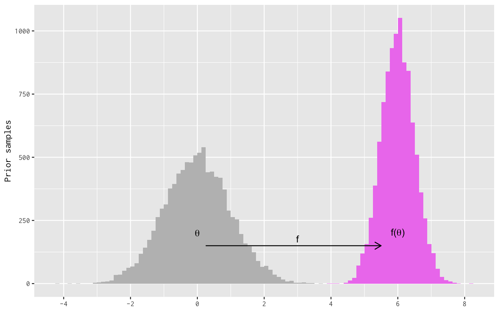
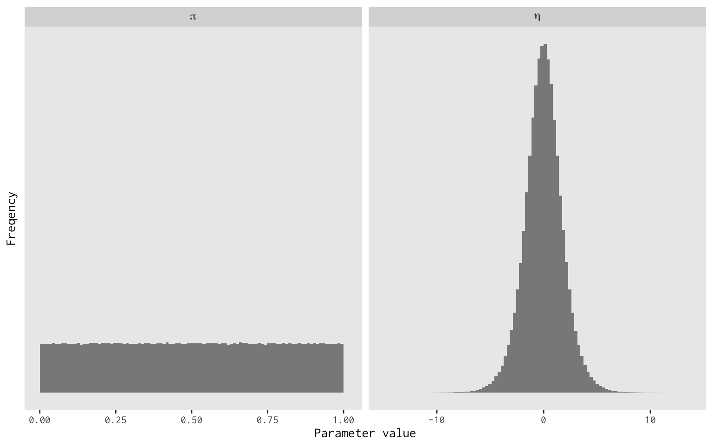

When many researchers first encounter Bayesian methods, they are nervous that their choice of prior distribution will ruin their posterior inferences.
Estimation under non-Bayesian methods feels "automatic", but Bayesian methods bear this additional risk of bad priors.[^1]
In this new uncertain territory, it initially feels safer to prefer flatter, more diffuse priors in your model.
How bad can flat priors be if, in the extreme, you merely get the same answer that you would have gotten without Bayes?

This blog post discuss some areas where this reasoning breaks down.
One, we discuss the fact that if some parameter has a prior, functions of that parameter have their own "implied" priors.
And depending on the nature of those functions, the implied prior may take a form that the researcher does not expect when they first specify the prior on the original parameter.[^2]
A flat prior in one part of the model often leads to non-flat priors over downstream quantities.
The default tendency to prefer flatness for all priors cannot avoid this.
Two, we see how the parameters and functions-on-parameters in our model depend on the parameterization of the model.
Different parameterizations naturally expose different parameters, and some parameters are easier to reason about than others.
Parameterization affects whether a prior's "flatness" is at all related to a prior's "informativeness".

## Implied priors

Let's say we have a model parameter, $\theta$, and we represent our uncertainty about this parameter with a probability distribution.
As far as our model is concerned, therefore, $\theta$ is a random variable.
If we pass $\theta$ to some function $f$, then the value $f(\theta)$ is also a random variable with its own distribution.
We can call the distribution of $f(\theta)$ its "implied prior".
You may hear others call it an "induced" prior.

We can construct an easy example by linearly transforming a Normal/Gaussian distribution.
Even if you don't do Bayesian statistics, the math here will probably be recognizable nonetheless, so it's a good example for building intuition.
Say that $\theta$ is a standard Normal variable (mean of 0, standard deviation of 1) and then define $f(\theta) = \mu + \sigma \theta$.
The result will be that $f(\theta)$ is distributed Normal with mean $\mu$ and standard deviation $\sigma$.
We can simulate this to convince ourselves that this is true.
I will use R for this, fixing the values of $\mu$ and $\sigma$.

First, I will load some packages.

``` r
library("latex2exp")
library("magrittr")
library("dplyr")
library("tidyr")
library("ggplot2")
```

``` r
# unlikely to work on your machine :)
theme_set(theme_gray(base_family = "InconsolataGo Nerd Font Complete"))
```

``` r
# helpful theme functions
remove_y_axis <- function() {
    theme(axis.text.y = element_blank(),
          axis.ticks.y = element_blank())
}
remove_grid <- function() {
    theme(panel.grid = element_blank())
}
```

Here we create the function `f`, generate some Normal draws, and then apply `f` to those draws.

``` r
sigma <- 1 / 2
mu <- 6
f <- function(x) { mu + sigma * x }

d = tibble::tibble(
    theta = rnorm(10000, mean = 0, sd = 1),
    f_theta = f(theta)
)

print(d)
## # A tibble: 10,000 × 2
##     theta f_theta
##     <dbl>   <dbl>
##  1  0.500    6.25
##  2  1.59     6.79
##  3  0.772    6.39
##  4  0.727    6.36
##  5  0.716    6.36
##  6  0.339    6.17
##  7  2.18     7.09
##  8 -0.502    5.75
##  9  0.477    6.24
## 10  0.656    6.33
## # ℹ 9,990 more rows
```

We plot the Normal draws alongside the implied distribution of `f_theta`.

``` r
# partial histogram w/ fixed args
phist <- purrr::partial(geom_histogram, bins = 100, boundary = 0)
# this alone is sufficient to make the point
histograms <- ggplot(d) +
    phist(aes(x = theta), fill = "gray") +
    phist(aes(x = f_theta), fill = "violet")

# but I make it pretty with labels and things
histograms +
    annotate("text", x = 0, y = 200, label = TeX('\\theta')) +
    annotate("text", x = 6, y = 200, label = TeX("f(\\theta)")) +
    annotate("segment", x = 0.25, xend = 5.5, y = 150, yend = 150,
             arrow = arrow(length = unit(0.3, 'cm'))) +
    annotate("text", x = 3, y = 150, label = "f", vjust = -0.5) +
    labs(x = NULL, y = "Prior samples") +
    scale_x_continuous(breaks = seq(-10, 10, 2))
```



For Normal random variables, linear transformation have familiar effects.
Add a constant, the mean increases by the same constant.
Multiply by a constant, the standard deviation increases by the same factor.

This paricular implied prior is something that Bayesians routinely take advantage of.
It is common to want a $X = \mathrm{Normal}(\mu, \sigma)$ prior where the values of $\mu$ and $\sigma$ are also unknown parameters.
Rather than specify that prior directly, it is often easier to sample $z = \mathrm{Normal}(0, 1)$ and compute $X = \mu + z\sigma$ after the fact.
This is called a "non-centered" parameterization.
It is useful because it de-correlates the Normal random variation (the $z$ component) from the variation in the priors for $\mu$ and $\sigma$.
This can improve the performance of Markov chain Monte Carlo sampling without losing any information about the $X$ quantity you ultimately want.

## Implied priors for nonlinear functions

Nonelinear functions will stretch or shrink their input values in non-constant ways, which matters big time for implied prior densities.
To see why, let's think about prior density in itself.
Say we have some probability mass of 1 that is uniformly distributed in some fixed interval of length $L$.
The density will be $1 / L$.
What would happen if we shrunk the interval by half?
The total mass in our interval stays the same, but the density would double to $1 / (L / 2)$ because we have to fit just as much probability mass into an interval of half the volume.
If we stretched the interval by a factor of two, the volume would also increase, but because we have constant probability mass, the density decreases to $1 / 2L$.

A nonlinear transformation will apply this stretching and shrinking *non-uniformly* over the interval.
Some regions of parameter space will be stretched (density decreases) and others will be compressed (density increases).
As a result, a prior distribution that has a recognizable shape may be unrecognizable after a nonlinear transformation is applied to its support.

I have an example of my own research with Ken Mayer on [voter identification requirements in Wisconsin](https://www.liebertpub.com/doi/abs/10.1089/elj.2018.0536),
which I will simplify for the sake of exposition.
Let's say that we have a voter registration file containing all registered voters in 2016 for a certain county.
The voter registration file says whether each registered voter casted a vote in 2016 (but vote choice is anonymous).
In this county, $N$ of the registrants in the file *did not vote*.
How many of these nonvoters *would have voted* if not for the state's voter identification requirement?

There are two parameters that would be helpful to know.
First, not every nonvoter in the voter file was eligible to vote at their registered address at the time of the election.
Many registrants move away, die, change their names, etc., so only some fraction of the $N$ nonvoters (say, $\varepsilon \in [0, 1]$) were eligible to vote as registered in 2016.
So that's one parameter; call it the "eligibity rate".
Next, of the $N \times \varepsilon$ eligible nonvoters, another proportion $\pi \in [0, 1]$ would have voted if not for the voter identification requirement.
Call this the "vote prevention rate".
Our quantity of interest is the total number of voters who would have otherwise voted, which is calculated as $N\varepsilon\pi$, and we only know $N$.

This means $\varepsilon$ and $\pi$ are parameters to be estimated.
Let's say we give these parameters independent, flat priors on the $[0,1]$ interval; what would be the implied prior for $N\varepsilon\pi$?
Let's simulate it again.
We use a $\mathrm{Beta}(1,1)$ prior for each probability parameter.
The Beta family is commonly used to model unknown probabilities[^3], and the $\mathrm{Beta}(1, 1)$ prior is a special case that gives flat density to all probability values.
But when we multiply all of these terms together, the result will not be flat at all.

``` r
# This is a real value from the data
N <- 229625

# simulate Beta priors for pi and epsilon
# calculate N . eps . pi
v <- tibble::tibble(
  pi = rbeta(100000, 1, 1),
  epsilon = rbeta(100000, 1, 1),
  pop_estimate = N * epsilon * pi
) 

print(v)
## # A tibble: 100,000 × 3
##        pi epsilon pop_estimate
##     <dbl>   <dbl>        <dbl>
##  1 0.194   0.831       37100. 
##  2 0.486   0.614       68506. 
##  3 0.291   0.349       23346. 
##  4 0.0174  0.0184         73.6
##  5 0.820   0.0605      11389. 
##  6 0.340   0.0232       1813. 
##  7 0.296   0.621       42310. 
##  8 0.0121  0.848        2355. 
##  9 0.233   0.258       13783. 
## 10 0.915   0.992      208438. 
## # ℹ 99,990 more rows
```

``` r
v |>
    pivot_longer(cols = everything(), names_to = "param") %>%
    mutate(
        param_label = case_when(param == "epsilon" ~ "Eligibility rate",
                                param == "pi" ~ "Vote prevention rate",
                                param == "pop_estimate" ~ "Would-be voters")
    ) %>%
    ggplot() +
        aes(x = value) +
        facet_grid(. ~ param_label, scales = "free") +
        geom_histogram(alpha = 0.7, boundary = 0, bins = 50) +
        scale_x_continuous(labels = scales::comma) +
        labs(x = NULL, y = "Frequency") +
        remove_y_axis() +
        remove_grid()
```


We started with flat priors for $\varepsilon$ and $\pi$, but the implied prior for our quantity of interest is far from flat.
If I had simply plopped this graphic into the paper and asserted that it was our prior for this quantity, we would have been in trouble over how *opinionated* it appears.
But it is simply the mechanical result of multiplying two independent probability values with vague priors.
The prior is still *uninformative*, but it's a mistake to think that flatness is the same thing.

## Parameterization, parameterization

Now that we have seen a $\mathrm{Beta}(1,1)$ prior, this would be a good time to talk about parameterization.

Let's say we observe a binary variable $y_{i}$ for a set of observations indexed $i$, and $y_{i}$ takes the value 1 with probability $\pi$ and 0 otherwise.
We give $\pi$ a flat $\mathrm{Beta}(1,1)$ prior, so our model looks like this:
But in applied modeling, we often model probabilities on the logit scale.
So we can introduce the log-odds (logit) parameter $\eta = \log\left(\frac{\pi}{1 - \pi}\right)$ and rewrite the model equivalently like so:
Only now we have to set a prior for $\eta$ instead of $\pi$.
If we wanted our prior to be flat for the probability parameter $\pi$, what prior would this be for the log-odds $\eta$?
I will simulate this by drawing $\pi$ from a flat Beta prior and calculating $\eta$ for each draw.

``` r
ps = tibble::tibble(
    pi = rbeta(1000000, 1, 1),
    eta = log(pi / (1 - pi))
)
```

``` r
ps |>
    tidyr::pivot_longer(cols = everything(), names_to = "param") %>%
    ggplot() +
        aes(x = value) +
        facet_grid(. ~ forcats::fct_rev(param), scales = "free", labeller = label_parsed) +
        geom_histogram(bins = 100, boundary = 0, alpha = 0.7) +
        remove_y_axis() +
        remove_grid() +
        labs(y = "Freqency", x = "Parameter value")
```



So a flat prior for a probability implies a very non-flat prior for the logit probability.
It turns out that the prior on the logit scale is a $\mathrm{Logistic}(0, 1)$ prior, which feels right when you remember that the inverse link function for logistic regression is the standard Logistic distribution function.
We would find a similar result modeling the probability with a probit model instead: we would need a $\mathrm{Normal}(0,1)$ prior on the probit scale to induce a flat prior on the probability scale.

The lesson here is that [priors only have meaning relative to some model parameterization](http://www.stat.columbia.edu/~gelman/research/published/entropy-19-00555-v2.pdf).
If there are many ways to rewrite the likelihood for a model, then a flat prior in one parameterization is unlikely to be flat for all parameterizations.
The consequence is that not all flat priors will be "noninformative", and plenty of noninformative priors won't look flat.
It all depends on what a parameter value means in specific parameter space.

## Nothing is safe: estimated causal effects are functions of parameters

Social scientists in the causal inference space often try to take a stance of principled agnosticism.
They want to impose few assumptions, invoke models only minimally, and use simple estimators based on differences in means.
But not even differences in means are safe.

We have an experiment with two groups, a control (0) and a treatment (1), with a binary outcome variable $y$.
The groups have unkown means (success probabilities) that we represent with $\mu_{0}$ and $\mu_{1}$, so the true treatment effect is $\tau = \mu_{1} - \mu_{0}$.
It's common among social scientists to estimate this as a regression with an indicator for treatment status:
where $Z_{i}$ is a treatment indicator and $e_{i}$ is random error.
Bayesians, always thinking about parameterization, would prefer to estimate the means directly:
because it is easier to give each group mean the same prior when the model is parameterized directly in terms of means.
It would be pretty confusing to set one prior for the control mean and another prior for the difference in means, which is itself a function of the control mean.
So let's go with the second parameterization.

Because this is causal inference and we want to be principled agnostics, we employ some default thinking and give each group mean a flat prior, estimating the difference in means after we have the means.
But if each group mean has a flat prior, what would be the implied prior for the difference in means?
*Not flat!*
We simulate another example, giving a flat prior to each mean and pushing the uncertainty into the treatment effect.

``` r
# simulate means and calculate difference
rct <- tibble::tibble(
  mu_0 = rbeta(1000000, 1, 1), 
  mu_1 = rbeta(1000000, 1, 1),
  trt = mu_1 - mu_0
)

print(rct)
## # A tibble: 1,000,000 × 3
##      mu_0    mu_1     trt
##     <dbl>   <dbl>   <dbl>
##  1 0.965  0.248   -0.716 
##  2 0.421  0.801    0.381 
##  3 0.0609 0.00852 -0.0524
##  4 0.942  0.410   -0.532 
##  5 0.222  0.918    0.696 
##  6 0.264  0.643    0.379 
##  7 0.764  0.798    0.0346
##  8 0.988  0.247   -0.741 
##  9 0.431  0.222   -0.209 
## 10 0.716  0.305   -0.411 
## # ℹ 999,990 more rows
```

``` r
rct |>
    tidyr::pivot_longer(cols = everything(), names_to = "param") %>%
    ggplot() +
        aes(x = value) +
        facet_grid(
            . ~ param,
            scales = "free",
            labeller = as_labeller(c("mu_0" = "Control mean",
                                     "mu_1" = "Treatment mean",
                                     "trt" = "Treatment effect"))
        ) +
        geom_histogram(boundary = 0, alpha = 0.7, bins = 50) +
        labs(y = "Frequency", x = "Parameter value") +
        remove_y_axis() +
        remove_grid()
```


So we started with a flat prior on our group means, and we ended up with a non-trivial prior for the treatment effect.
How did this happen?
Averaging over my prior uncertainty in both groups, my expected difference in means ought to be mean zero (naturally).
But more than that, we get a mode at zero because there are *many more ways* to obtain mean differences near zero than differences far from zero.
We get big differences (near -1 or 0) only when both means are far apart, which isn't as likely to happen randomly as two means that are a little closer together in the prior.

If we really wanted a flat prior on the treatment effect, what we would be saying is that big treatment effects are just as likely as small treatment effects.
But this doesn't make sense.
If we devise a reasonable prior for our control group mean, and then we encode a "null" view into the treatment mean that it has the same prior as the control group, then the notion that "big treatment effects are just as likely as small treatment effects" is simply untenable.
We should prefer to set reasonable priors for our grouop means directly and let the treatment effect prior take care of itself.

## Let go of the need for flatness

These implications feel strange at first, but they are all around us whether we notice them or not.
The flatness of a prior (or any shape, flat or not) is a relative feature of a model parameterization or a quantity of interest, not an absolute one.
Inasmuch as we believe priors are at work even when we don't want to think about them---i.e. we accept Bayesian models as generalizations of likelihood models---we should respect how transforming a likelihood affects which parameters are exposed to the researcher, and which spaces those parameters are defined in.
We should know that flat priors aren't necessarily vague, and vague priors aren't necessarily flat.
What we're seeing here is that flatness begets non-flatness in tons of scenarios, but that is totally ordinary and nothing to be worried about.

[^1]: For academic social scientists, at least, for whom unregularized least-squares or maximum likelihood estimation still dominate.
    Once you begin caring about regularization to prevent overfitting your model to your data, non-Bayesian inference quickly stops being automatic.
    But that's academia for you: the luxury of never actually having to pay your loss function.

[^2]: The shape of an implied prior can be quite useful in practice, when you know what you are getting into.
    For example, common methods for regularizing a linear model, like ridge and LASSO regression, have (loosely) analogous Bayesian prior distributions.
    Topic for a future post maybe.

[^3]: Even in non-Bayesian inference, the Clopper-Pearson confidence interval is based on Beta distributions.
