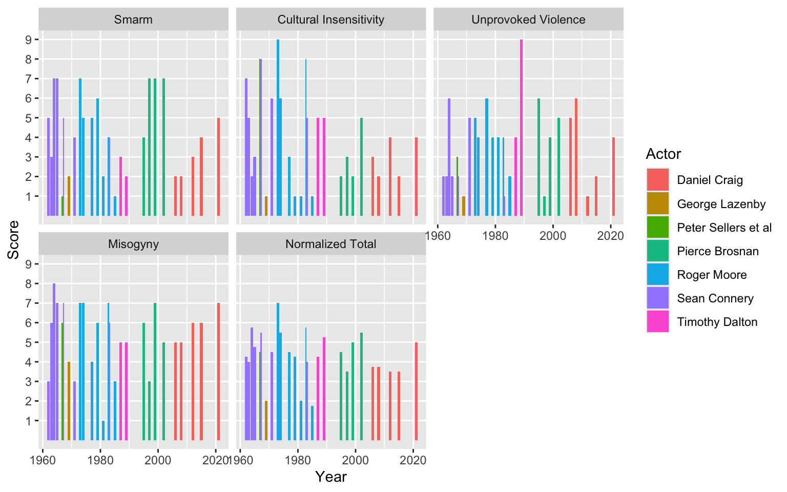

<meta name="mermaid-theme" content="dark"/>
<script  src="index_files/libs/quarto-diagram/mermaid.min.js"></script>
<script  src="index_files/libs/quarto-diagram/mermaid-init.js"></script>
<link  href="index_files/libs/quarto-diagram/mermaid.css" rel="stylesheet" />

This post describes the process for scraping "S.C.U.M." score data from the *Kill James Bond* podcast website.

To perform the scraping, we design a functional interface that lets us easily generate sequences of data and map functions over those sequences.

Along the way, we employ a functional optimization concept called **memoization**.
Memoization, crudely, is when when a function "caches its own return value" to make repeated calls more efficient.
Think of it like a function that remembers every argument it ever saw and every value it ever computed.
If that sounds fuzzy, we explain it with more detail below.

This is also my first significant attempt at web scraping, so it was a useful exercise even if I did not write the smoothest thing in the world.

## *Kill James Bond* and the S.C.U.M. scores

First, some background on the data.

*Kill James Bond* is a comedic film review podcast where the hosts marathon the James Bond movie franchise "in an attempt to give 007 the socialist, feminist comeuppance he so richly deserves."
I don't know how if "socialist" is the word I would use, but it is a culturally left-leaning critique of how the films depict gender, race, and government-sanctioned violence.
It is pretty funny and often genuinely insightful about film and storytelling broadly.

### S.C.U.M. scores

> "We have a science-based system on this podcast."

At the end of each episode, the hosts rank each movie on a scale of 1[^1] to 7[^2] across four dimensions:

-   **S**marm
-   **C**ultural insensitivity
-   **U**nprovoked violence
-   **M**isogyny

or "S.C.U.M.".
These four scores are summed to create a total scum score for the movie.[^3]

## Scraping the S.C.U.M. data

We have to write some code.
I am not an experienced web-scraper, but my gut feeling has always been that because websites can be idiosyncratic and prone to change, that any code you write to scrape data from the website might take on similar ugliness.
So I wanted to design something that would make this as smooth as I could.

When we start our journey, the website is a black box.
I know what I want, but I don't know how to get it.
So our first decision is that our API should be declarative (the interface describes the desired results) rather than imperative (the interface describes the process).

What do I want, exactly?
Every movie has four component S.C.U.M. scores and some other metadata (movie title, year, which actor played James Bond).
So I want a way to map a movie to a tuple (or "record") of values.
I want a set of functions that take me to each of these individual values...

<figure class=''>

<pre class="mermaid mermaid-js">flowchart LR
A[Movie] --&gt; B[Title]
A[Movie] --&gt; C[Year]
A[Movie] --&gt; D[Actor]
A[Movie] --&gt; E[S.C.U.M. Scores]
</pre>

</figure>

So that I could combine these values into a tuple like so:

<figure class=''>

<pre class="mermaid mermaid-js">flowchart LR
A[Movie] --&gt; B[&quot;(Title, Year, Actor, SCUM scores)&quot;]
</pre>

</figure>

And of course, I should be a be able to generate a list of all movies from the website in order to compute this tuple of values for each movie.

<figure class=''>

<pre class="mermaid mermaid-js">flowchart LR
A[Website] --&gt; B[Movie A]
A[Website] --&gt; C[Movie B]
A[Website] --&gt; D[Movie C]
B --&gt; E[&quot;(Title, Year, Actor, SCUM scores)&quot;]
C --&gt; F[&quot;(Title, Year, Actor, SCUM scores)&quot;]
D --&gt; G[&quot;(Title, Year, Actor, SCUM scores)&quot;]
</pre>

</figure>

To make this slightly more tangible, the [website](https://www.killjamesbond.com/) contains an [index page](https://www.killjamesbond.com/scum-rankings) that links out to each individual movie.
And if you navigate to the page for a [specific movie](https://www.killjamesbond.com/dr-no), you see all the data you want to get.
So I can basically think of the problem like this:

-   Starting with the global site url, I can generate a sequence of film urls.
-   I write a function (call it `get_movie_data`) that takes a film url and generates a record of SCUM scores and other metadata.
-   Map the `get_movie_data` function over the sequence of film urls.

In lispy pseudocode it's merely this...

    (map get_movie_data 
        (get_movie_urls home_url))

or in R, it would be like this:

``` r
home_url |>
    get_movie_urls() |>
    lapply(get_movie_data)
```

This would give me a list with one element per film, and each film's element would be a record (really, a named list) of SCUM data.

### Sequence of film URLs

Now that we have an interface outline, we need an implementation to back it up.

Let's start by making a `get_movie_urls` function.
On the [film index page](https://www.killjamesbond.com/scum-rankings), there is a `".gallery-grid-image-link"` class, which holds one image per movie, alt text for each image, and a url that takes you to the film page if you click the image.
So this is where we collect the film-specific urls.

``` r
library(httr2)
library(rvest)
library(stringr)

get_film_urls = function(home) {
    film_index_url = append_url(home, "scum-rankings")
    # the movies are indexed in a "grid" gallery
    # make a list of html elements corresponding to each film's gallery entry
    grid_nodes = home |>
        append_url("scum-rankings") |>
        read_html() |>
        html_elements(css = ".gallery-grid-image-link")
    # construct film URLs by selecting the hrefs for each film
    # and appending that slug to the home url
    slugs = Map(href_slug, grid_nodes)
    sapply(slugs, function(s) append_url(home, s))
}

#helper functions:

# this is just a safe way to modify urls
append_url = function(url, path) {
    req_url_path_append(request(url), path)$url
}

# extract the href field from an <a> anchor
href_slug = function(obj) {
    obj |> html_attr("href") |> str_remove("/")
}
```

Let's see how we did.

``` r
home_url = "https://killjamesbond.com"
(film_urls = get_film_urls(home_url))
##  [1] "https://killjamesbond.com/dr-no"                         
##  [2] "https://killjamesbond.com/from-russia-with-love"         
##  [3] "https://killjamesbond.com/goldfinger"                    
##  [4] "https://killjamesbond.com/thunderball"                   
##  [5] "https://killjamesbond.com/you-only-live-twice"           
##  [6] "https://killjamesbond.com/on-her-majestys-secret-service"
##  [7] "https://killjamesbond.com/diamonds-are-forever"          
##  [8] "https://killjamesbond.com/live-and-let-die"              
##  [9] "https://killjamesbond.com/golden-gunman"                 
## [10] "https://killjamesbond.com/the-spy-who-loved-me"          
## [11] "https://killjamesbond.com/moonraker"                     
## [12] "https://killjamesbond.com/for-your-eyes-only"            
## [13] "https://killjamesbond.com/octopussy"                     
## [14] "https://killjamesbond.com/never-say-never-again"         
## [15] "https://killjamesbond.com/a-view-to-a-kill"              
## [16] "https://killjamesbond.com/the-living-daylights"          
## [17] "https://killjamesbond.com/licence-to-kill"               
## [18] "https://killjamesbond.com/goldeneye"                     
## [19] "https://killjamesbond.com/tomorrow-never-dies"           
## [20] "https://killjamesbond.com/the-world-is-not-enough"       
## [21] "https://killjamesbond.com/die-another-day"               
## [22] "https://killjamesbond.com/casino-royale-1967"            
## [23] "https://killjamesbond.com/casino-royale"                 
## [24] "https://killjamesbond.com/quantum-of-solace"             
## [25] "https://killjamesbond.com/skyfall"                       
## [26] "https://killjamesbond.com/spectre"                       
## [27] "https://killjamesbond.com/no-time-to-die"
```

Looks good.

### Film-specific data

(Have I mentioned that I am not experienced with web scraping?
Please try to remember that.)

Recall what a [film page looks like](https://killjamesbond.com/dr-no).
<!-- https://www.killjamesbond.com/dr-no). -->

-   At the top there are headers containing the film title, the actor who played James Bond, and the year the film was released.
-   Below that, there is a table with data on each of four S.C.U.M. scores.
-   Below the S.C.U.M. table, there is a total S.C.U.M. score that should (in theory) be the sum of the component scores.

We make this interface easy for the user by defining a function that takes a url and returns a particular data value, such as the movie's title or the "Smarm" score.
This simple interface pattern---url in, value out---will let us easily apply this set of functions to the list of urls we created above.

Here I show a first-cut at the interface.
Each function has to do some variation on the same thing:

-   starting with a url, we first call `read_html` to collect the html code from each page url.
-   we then extract specific content fields from the html that correspond to each data field that we need.
-   Sometimes we need to sanitize certain fields or cast string values to numeric values, stuff like that.

``` r
# I always think this helper function is unreasonably useful
item = function(x, ...) x[[...]]

get_movie_title = function(url) {
    url |>
        read_html() |>
        html_nodes("h1") |>
        html_text() |>
        trimws()
}

get_movie_actor = function(url) {
    url |>
        read_html() |>
        html_nodes("h3") |>
        html_text() |>
        item(1) |>
        str_split(" - ") |>
        unlist() |>
        item(1) |>
        trimws()
}

get_movie_year = function(url) {
    url |>
        read_html() |>
        html_nodes("h3") |>
        html_text() |>
        item(1) |>
        str_split(" - ") |>
        unlist() |>
        item(2) |>
        readr::parse_number()
}

get_scum_total = function(url) {
    url |>
        read_html() |>
        html_nodes("h3") |>
        html_text() |>
        item(2) |>
        readr::parse_number()
}

get_all_scum_components = function(url) {
    names = url |>
        read_html() |>
        html_nodes(".tg-soxh") |>
        html_text() |>
        tolower() |>
        str_replace_all(" ", "_")
    values = url |>
        read_html() |>
        html_nodes(".tg-3fto") |>
        html_text() |>
        readr::parse_number()
    # returns a named vector
    setNames(values, names)
}

get_scum_component = function(url, name) {
    get_all_scum_components(url)[[name]]
}
```

Here are the values we get when we evaluate these functions on an individual film url.

``` r
ex = film_urls[1]

get_movie_title(ex)
## [1] "Dr No"
get_movie_actor(ex)
## [1] "Sean Connery"
get_movie_year(ex)
## [1] 1962
get_scum_total(ex)
## [1] 17
get_scum_component(ex, "smarm")
## [1] 5
get_scum_component(ex, "cultural_insensitivity")
## [1] 7
get_scum_component(ex, "unprovoked_violence")
## [1] 2
get_scum_component(ex, "misogyny")
## [1] 3
```

So the user doesn't really have to know anything about scraping to get these data fields out of a film page.

So we are done, right?
Well, I haven't explained a concept from functional programming that you never asked to have explained to you.
That's how you know we aren't done.

### The code is too slow.

It takes too long to run this set of functions.

``` r
times = system.time(
    list(
        get_movie_title(film_urls[1]),
        get_movie_actor(film_urls[1]),
        get_movie_year(film_urls[1]),
        get_scum_total(film_urls[1]),
        get_scum_component(film_urls[1], "smarm"),
        get_scum_component(film_urls[1], "cultural_insensitivity"),
        get_scum_component(film_urls[1], "unprovoked_violence"),
        get_scum_component(film_urls[1], "misogyny")
    )
)
times
##    user  system elapsed 
##   0.556   0.051   3.947
```

3.9 seconds per film?
There are 27 films to get through.
It's not a *huge* amount of time, but it longer than we need.

The pain point is `read_html`.
R has to visit a web page and copy all of the html code on the page.
But because I call `read_html` in *every single one of these functions*, I pay this cost over and over.
What can we do?

**One idea: we could read the html once and save it into its own object.**
We can then pass the html code to each value-getter function instead of the url.
But I don't think this is a good idea for a few reasons.
First, it asks the user code to hold onto a list of 27 film URLs *and* 27 of their respective html objects, which is annoying.
Secondly, it moves the user interface away from something intuitive (urls) and toward something less intuitive (globs of html code).
It *bothers the user with implementation details that they shouldn't have to worry about*.
The url is the obvious access point for each film's data, so the interface should settle for nothing less than the obvious entities.

**Another idea: a "Python-flavored" approach would be to write a class that has a special `read_and_save_html` method.**
When we call this class's `get_movie_title` method, for example, that method would internally call `read_and_save_html`, which would save the html data as an attribute on the object itself.
More generally, when we call any of these `get_xyz` functions, we check to see if the html attribute is present, so we would only download the html code if it isn't already there.
This idea has some advantages, but it would require the user to wrangle these single-use class instances instead of the urls.
The urls are simple.
This class, if I wrote it, would not be so simple.
And any time I move from a simple thing to a complex thing, it is a compromise.
I *already have the data I need*, which is the url damnit, and I *already have the functions I need* to call on the url.
Surely we can come up with a way to make this faster without compromising the elegant `url --> value` interface that we wanted to base our designs around.

And we can, by **memoizing** the `read_html` function.
Memoizing will give us the same performance boost as the other methods (we download the html code just one time), but it does not compromise the interface interactions in any way.
Really.

## A very brief intro to memoization

A (pure) function is a machine for turning an input into an output.
It is glorified lookup table.
Give me a key, and I look up the associated value.

Memoization is an optimization technique for pure functions that takes the "lookup table" interpretation of a function quite literally.
It works like this:

-   The function holds an internal lookup table from every input it has received to every output it has computed.
-   The first time the function receives a particular input, the value must be calculated from scratch.
    But before the value is returned, we associate the input to the output in this internal lookup table.
-   If the function is ever called with the same argument again, we don't need to compute the value from scratch.
    We can instead lookup the previously computed value from the internal table.

This technique is valuable when a function is expensive and will be called multiple times.

Here is a simple demonstration in Python, because Python makes it very clear to see the implementation.[^4]
Say I have a function called `double`, which returns two times its input.

``` python
def double(x):
    print(f"doubling {x}")
    return 2 * x
```

The print statement lets us know when the function is being evaluated.
If I call this function several times, I see the print statement each time.

``` python
double(4)
## doubling 4
## 8
double(4)
## doubling 4
## 8
double(4)
## doubling 4
## 8
```

But now I want to memoize this function.
So we write a `memoize` function, which takes a function as an argument and returns a memoized function as an output.

``` python
def memoize(func):
    already_evaluated = {}
    def _memoized_fn(*args):
        if args in already_evaluated:
            return already_evaluated[args]
        computed_value = func(*args)
        already_evaluated[args] = computed_value
        return computed_value
    return _memoized_fn
```

`memoize` creates a lookup table called `already_evaluated` that associates an argument to a computed value every time the function sees a new argument.
So the memoized function is a *closure* that encloses the lookup table.

So we create our memoized function that is just like the `double` function, but memoized.

``` python
memo_double = memoize(double)
```

The first time I call `memo_double` with argument `4`, the function will be evaluated like normal.

``` python
memo_double(4)
## doubling 4
## 8
```

But subsequent calls with the same argument `4` return the already-computed value without re-evaluating the function.
We know that this is working because repeated calls to `memo_double` return the correct value without any printing.

``` python
memo_double(4)
## 8
memo_double(4)
## 8
```

The upside of this trick is that repeated function calls are only as expensive as a lookup table.
The downside is we have to store the table in memory.
But this isn't so bad; all of our alternative approaches needed to store the downloaded html code in memory anyway.
If anything, memoization is *strictly better* because we don't have to compromise our user interface in any way!

## Reimplementing a memoized API.

Let's bring it back to the scraping example.

First we get the memoization package and memoize the costly `read_html` function.

``` r
library(memoise)

memo_read_html = memoize(read_html)
```

When we call `memo_read_html` for one film page, all of our data-selector functions can re-use that cached data without paying the cost of reading the html again.
Nice!

Now we need to replace all instances of `read_html` with `memo_read_html` in our interface functions.

``` r
get_movie_title = function(url) {
    url |>
        memo_read_html() |>
        html_nodes("h1") |>
        html_text() |>
        trimws()
}

get_movie_actor = function(url) {
    url |>
        memo_read_html() |>
        html_nodes("h3") |>
        html_text() |>
        item(1) |>
        str_split(" - ") |>
        unlist() |>
        item(1) |>
        trimws()
}

get_movie_year = function(url) {
    url |>
        memo_read_html() |>
        html_nodes("h3") |>
        html_text() |>
        item(1) |>
        str_split(" - ") |>
        unlist() |>
        item(2) |>
        readr::parse_number()
}

get_scum_total = function(url) {
    url |>
        memo_read_html() |>
        html_nodes("h3") |>
        html_text() |>
        item(2) |>
        readr::parse_number()
}

get_all_scum_components = function(url) {
    names = url |>
        memo_read_html() |>
        html_nodes(".tg-soxh") |>
        html_text() |>
        tolower() |>
        str_replace_all(" ", "_")
    values = url |>
        memo_read_html() |>
        html_nodes(".tg-3fto") |>
        html_text() |>
        readr::parse_number()
    # returns a named vector
    setNames(values, names)
}

# sike, it will also be useful to memoize this,
# since we will call it 4 times per film
memo_get_all_scum_components = memoize(get_all_scum_components)

# use the memoized fn internally
get_scum_component = function(url, name) {
    memo_get_all_scum_components(url)[[name]]
}
```

Now let's see how fast it takes to run all of these functions for one film.

``` r
memo_times = system.time(
    list(
        get_movie_title(film_urls[1]),
        get_movie_actor(film_urls[1]),
        get_movie_year(film_urls[1]),
        get_scum_total(film_urls[1]),
        get_scum_component(film_urls[1], "smarm"),
        get_scum_component(film_urls[1], "cultural_insensitivity"),
        get_scum_component(film_urls[1], "unprovoked_violence"),
        get_scum_component(film_urls[1], "misogyny")
    )
)
memo_times
##    user  system elapsed 
##   0.058   0.003   0.354
```

0.354 seconds, a 11x speedup in this example.

## Fulfilling our interface promise

I promised that we would eventually get this into one function that maps us from a url to a tuple of data.
R doesn't have tuples, so a named list will have to do.[^5]

``` r
get_movie_data = function(url) {
    values = list(
        title = get_movie_title(url),
        actor = get_movie_actor(url),
        year = get_movie_year(url),
        smarm = get_scum_component(url, "smarm"),
        cultural_insensitivity = get_scum_component(url, "cultural_insensitivity"),
        unprovoked_violence = get_scum_component(url, "unprovoked_violence"),
        misogyny = get_scum_component(url, "misogyny"),
        scum_total_raw = get_scum_total(url)
    )
    total = with(values, smarm + cultural_insensitivity + unprovoked_violence + misogyny)
    c(values, scum_total_calc = total)
}
```

And here is the promised payoff.
This is the whole routine, right here.
I start with a site url, I map it to a sequence of film urls, and then I apply `get_movie_data` to each film url.
That's it.

``` r
records = home_url |>
    get_film_urls() |>
    lapply(get_movie_data)

head(records, 2)
## [[1]]
## [[1]]$title
## [1] "Dr No"
## 
## [[1]]$actor
## [1] "Sean Connery"
## 
## [[1]]$year
## [1] 1962
## 
## [[1]]$smarm
## [1] 5
## 
## [[1]]$cultural_insensitivity
## [1] 7
## 
## [[1]]$unprovoked_violence
## [1] 2
## 
## [[1]]$misogyny
## [1] 3
## 
## [[1]]$scum_total_raw
## [1] 17
## 
## [[1]]$scum_total_calc
## [1] 17
## 
## 
## [[2]]
## [[2]]$title
## [1] "From Russia with Love"
## 
## [[2]]$actor
## [1] "Sean Connery"
## 
## [[2]]$year
## [1] 1963
## 
## [[2]]$smarm
## [1] 3
## 
## [[2]]$cultural_insensitivity
## [1] 5
## 
## [[2]]$unprovoked_violence
## [1] 2
## 
## [[2]]$misogyny
## [1] 6
## 
## [[2]]$scum_total_raw
## [1] 16
## 
## [[2]]$scum_total_calc
## [1] 16
```

I could do one better.
Because this function returns a list of records, we could turn it into a data frame directly.

``` r
library(dplyr)

df = home_url |>
    get_film_urls() |>
    lapply(get_movie_data) |>
    bind_rows() |>
    print()
## # A tibble: 27 × 9
##    title   actor  year smarm cultural_insensitivity unprovoked_violence misogyny
##    <chr>   <chr> <dbl> <dbl>                  <dbl>               <dbl>    <dbl>
##  1 Dr No   Sean…  1962     5                      7                   2        3
##  2 From R… Sean…  1963     3                      5                   2        6
##  3 Goldfi… Sean…  1964     7                      2                   6        8
##  4 Thunde… Sean…  1965     7                      3                   2        7
##  5 You On… Sean…  1967     5                      8                   2        7
##  6 On Her… Geor…  1969     2                      1                   1        4
##  7 Diamon… Sean…  1971     4                      6                   5        3
##  8 Live a… Roge…  1973     7                      9                   5        7
##  9 The Ma… Roge…  1974     5                      6                   4        7
## 10 The Sp… Roge…  1977     5                      3                   6        4
## # ℹ 17 more rows
## # ℹ 2 more variables: scum_total_raw <dbl>, scum_total_calc <dbl>
```

Done!

We might as well plot scumminess over time as a payoff for all of our hard work.

``` r
library(ggplot2)
```

``` r
ordered_levels = c(
    smarm = "Smarm",
    cultural_insensitivity = "Cultural Insensitivity",
    unprovoked_violence = "Unprovoked Violence",
    misogyny = "Misogyny",
    avg_scum = "Normalized Total"
)


df |>
    mutate(avg_scum = scum_total_calc / 4) |>
    tidyr::pivot_longer(
        c(smarm, cultural_insensitivity, unprovoked_violence, misogyny, avg_scum),
    ) |>
    (function(d)
     ggplot(d) +
     aes(x = year, y = value) +
     facet_wrap(
        ~ forcats::fct_relevel(name, names(ordered_levels)), 
        labeller = as_labeller(ordered_levels)
     ) +
     geom_col(aes(fill = actor), position = "dodge") +
     labs(fill = "Actor", x = "Year", y = "Score") +
     scale_y_continuous(breaks = 1:9) +
     theme(panel.grid.minor.y = element_blank())
    )()
```



Not the prettiest plot, but some things stand out.
Although each score is only supposed to go from 1 to 7, we see that Connery once scored himself an 8 on misogyny, we have had a few 8s and even a 9 on cultural insensitivity, and Dalton scores a 9 on unprovoked violence (which was deeeeefinitely for License to Kill).

[^1]: Or is the lower bound 0?
    I actually don't know.
    At any rate, 1 is the lowest score we see in the data.

[^2]: Some movies occasionally get scores greater than 7 also, which we may discuss in a future post that features the data.

[^3]: Is a simple sum appropriate?
    A conversation for the next post.

[^4]: 
    Python has a memoization tool in the standard library: `functools.cache`.
    But it only works with hashable function arguments (I guess the computed values are stored by the input hashes).
    Unfortunately most data containers in python are unhashable, like lists, sets, dictionaries, Numpy arrays, and Pandas dataframes, which makes memoization challenging.
    Furthermore, almost all data in Python is mutable, so if a memoized function returns a mutable object (such as a list, set, dictionary, etc.), and you mutate that object somewhere else, the memoized function will return the mutated value instead of the value it *would have computed* from scratch.
    R has a third-party package called `memoise` that gives you a `memoise::memoise` function.
    I am not as familiar with caching in R, but because R data is mostly immutable (R has "copy-on-modify"), memoizing feels smoother from my limited experience.

[^5]: Notice that I am calling a set of functions that each share the same signature, `url`.
    This is actually a perfect case for using a `juxt` combinator, which takes a sequence of functions and returns a lambda that produces a sequence of values.
    I got [made fun of](https://twitter.com/Apoorva__Lal/status/1758315348187811844) last time I brought up `juxt`.
    But look, if you design interfaces around sequence operations, then you will likely find situations where `juxt` makes sense.
    Imagine our `get_movie_data` function looked like this:

    ``` r
    get_movie_data = function(url) {
        compute_all_values = juxt(
            title = get_movie_title,
             actor = get_movie_actor,
             year = get_movie_year,
             smarm = \(u) get_scum_component(u, name = "smarm"),
             cultural_insensitivity = \(u) get_scum_component(u, name = "cultural_insensitivity"),
             unprovoked_violence = \(u) get_scum_component(u, name = "unprovoked_violence"),
             misogyny = \(u) get_scum_component(u, name = "misogyny")
        )
        vals = compute_all_values(url)
        c(vals,
          total = with(vals, smarm + cultural_insensitivity + unprovoked_violence + misogyny))
    }
    ```

    Would that be so bad?
    I actually think this feels less cluttered than the "official"version.
    A little justice for `juxt` is all I'm saying.
